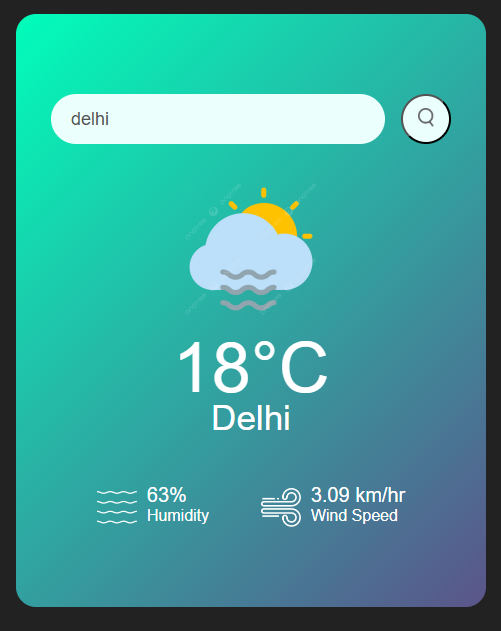

# 🌦️ Weather App

A simple weather application built using **HTML**, **CSS**, and **JavaScript**, which fetches real-time weather data using the **OpenWeatherMap API**. The user can enter any city name to view its current temperature, humidity, wind speed, and a relevant weather icon.

🔗 **Live Demo**: [Click here to check it out](https://7d99d9m8-5500.inc1.devtunnels.ms/)  

---

## 📌 Features

- 🌐 Real-time weather information for any city
- 🌡️ Displays temperature in Celsius
- 💧 Shows humidity levels
- 💨 Displays wind speed
- 🖼️ Dynamic weather icons based on weather condition
- ❌ Error message shown for invalid or unknown cities

---

## 🛠️ Tech Stack

- **HTML5** – Page structure  
- **CSS3** – Styling and layout  
- **JavaScript (Vanilla)** – Logic, API integration, DOM manipulation  
- **OpenWeatherMap API** – To fetch real-time weather data

---

## 🧠 What I Learned

- How to fetch and handle data from public APIs using `fetch()` and `async/await`
- DOM manipulation and event handling in JavaScript
- Basic error handling and user feedback UI
- Organizing assets like images and keeping file structure clean
- Making simple, functional UIs with no frameworks

---

## User Interface

